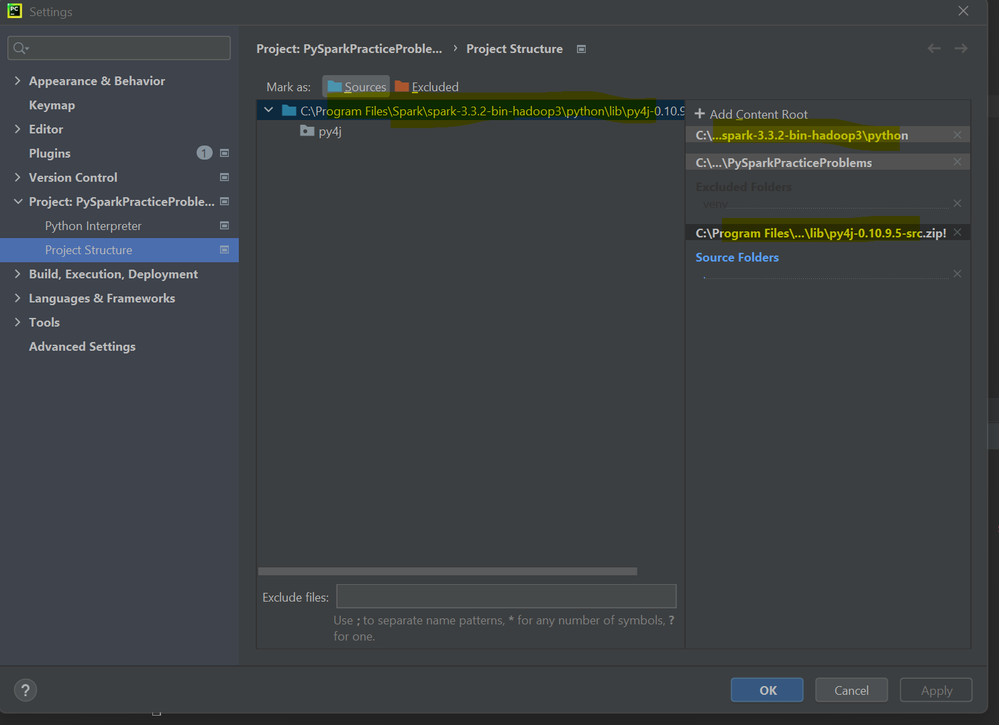
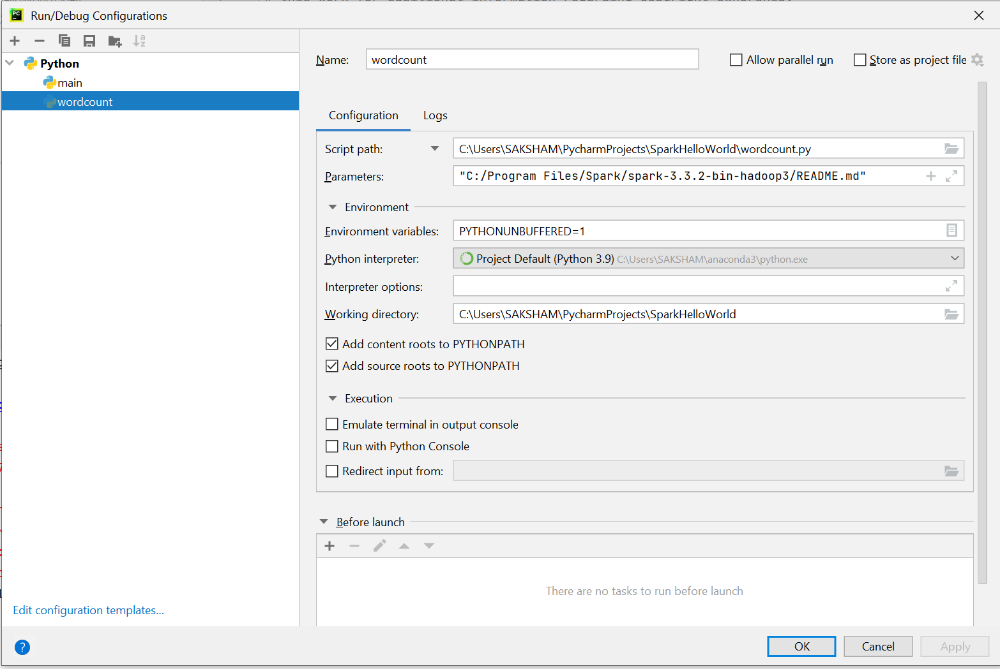

#Steps For Setup
1. Follow article for spark setup and configuration and NEw project in PyCharm "https://blog.stevengong.co/how-to-use-pyspark-in-pycharm-ide-2fd8997b1cdd"
2. Same as in above article add and create variables 
   1. SPARK_HOME = C:\Program Files\Spark\spark-3.3.2-bin-hadoop3 
   2. HADOOP_HOME = C:\Program Files\Spark\spark-3.3.2-bin-hadoop3 (Pay attention on version you write above is equal to version that you have downloaded)
   3. Add to Path: C:\Program Files\Spark\spark-3.3.2-bin-hadoop3\bin

3. Add Locations in Project Structure. These locations were created as part of Spark Installation

#Validations
1. CD to "C:\Program Files\Spark\spark-3.3.2-bin-hadoop3\bin" and run command "spark-submit "C:\Program Files\Spark\spark-3.3.2-bin-hadoop3\examples\src\main\python\wordcount.py" "C:\Program Files\Spark\spark-3.3.2-bin-hadoop3\README.md""
2. CD to "C:\Program Files\Spark\spark-3.3.2-bin-hadoop3\bin" and run pyspark for python
3. CD to "C:\Program Files\Spark\spark-3.3.2-bin-hadoop3\bin" and run spark-shell for scala
4. Since Location ""C:\Program Files\Spark\spark-3.3.2-bin-hadoop3\bin"" is already added to path. commands pyspark and spark-shell will run from any location on local system no need to do cd always

#Errors
1. Turn OFF Alias
   1. https://answers.microsoft.com/en-us/windows/forum/all/why-i-cannot-turn-off-app-execution-aliases/d8b2d32e-e305-43db-8e5b-2512bcf201cb
   2. https://stackoverflow.com/questions/68246173/python-was-not-found-but-can-be-installed-when-using-spark-submit-on-windows

#Word Count Configuration
